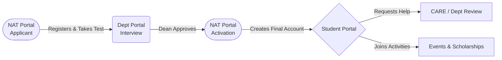

# NORSU System: Easy Understanding & Tech Guide 🚀

This guide is written to help everyone on the team understand what our system is, who uses it, its top features, and the technology powering it. You can easily grasp the entire app by reading this document in just a few minutes!

---

## 1. What is this System?
Our project is a **Student Services and Needs Assessment App** for NORSU. Think of it as a central hub where everything related to a student's non-academic college life is handled. 

Instead of passing physical papers around, students use our app to request help, sign up for events, get counseling, and apply for scholarships. The university staff (like Deans and CARE/Guidance Counselors) use the app to track, manage, and help these students.

---

## 2. The Flow: Journey of a Student 🗺️

Here is how a person moves through our system from the very beginning. 

1. **Applicant Phase:** A person wants to study at NORSU. They go to the **NAT (Needs Assessment Test) Portal**, register their details, pick a schedule, and take their admission test.
2. **Department Review Phase:** The College/Department sees the application. The Dean reviews the applicant, schedules them for an interview, and finally says, *"Yes, you are approved to enroll!"*
3. **Activation Phase:** The applicant goes back to the NAT portal, clicks "Activate", and uses their student ID to turn their applicant account into a permanent **Student Account**.
4. **Student Life Phase:** Now inside the **Student Portal**, the active student can request counseling, ask for ID replacements, apply for scholarships, or join university events. 

---

## 3. The 5 Main Portals 🚪
To keep things safe and organized, our system is split into **5 different portals (or doors)**. Depending on who you are, you log into a different portal.

### 🌐 Portal 1: The Public Landing Page
* **Who uses it:** Anyone, Visitors, Public
* **What is it?** This is the very first page of the website. It contains general information about the university's student services and has big buttons linking off to the other portals.

### 📝 Portal 2: The NAT Portal (Applicants)
* **Who uses it:** Incoming Freshmen or Transferees
* **What is it?** The waiting room for people who want to be students. 
* **Key Actions:** Applicants fill out a long registration form, pick the course they want, choose a date to take their entrance exam (NAT), and eventually use this to see if they passed the interview.

### 🎓 Portal 3: The Student Portal
* **Who uses it:** Enrolled NORSU Students
* **What is it?** The main app for the students. It looks like a nice dashboard on their phone or laptop.
* **Key Actions:** 
  * View their personal profile
  * Pick a date and time to talk to a guidance counselor.
  * Ask for help with lost IDs or department clearances.

### 🏢 Portal 4: The Department Portal
* **Who uses it:** College Deans, Department Heads, College Staff
* **What is it?** The local workspace for a specific College (e.g., College of Engineering). You ONLY see students and issues related to your specific college.
* **Key Actions:** 
  * Manage the admissions interview queue.
  * Handle initial student counseling or pass the issue up to the CARE Staff.

### 🏥 Portal 5: The CARE Staff Portal
* **Who uses it:** Guidance Counselors, University Student Affairs Staff
* **What is it?** The highest level of student support. They deal with the heavy issues and the big university-wide events.
* **Key Actions:** 
  * Upload NAT results.
  * Provide serious counseling and interventions.
  * Create events and scholarships for students to see.

*(**Bonus: Admin Portal** ⚙️ — The IT Control room to manage staff accounts, clean the database, and monitor system security.)*

---

## 4. Feature Checklist ⭐
*What can the system actually do? Try imagining doing these inside the app:*

- [x] **Digital NAT Admissions:** Replaces paper forms. Applicants register online, and departments filter them digitally through interviews.
- [x] **Smart Counseling Workflow:** A bridge between students and counselors. A student asks for help -> The Department sees it first -> If the Department can't help, they escalate it to the CARE Staff.
- [x] **Support Ticketing System:** Like a customer service desk. A student complains, asks a question, or requests a document, and the exact department gets notified to help them.
- [x] **Automated Email Notifications:** The system sends real emails to remind students of their interview dates or counseling schedules.
- [x] **Event & Scholarship Tracker:** Students don't need bulletin boards anymore. They can open the app, browse campus events or scholarships, and apply with one click.
- [x] **Live Analytics:** Colorful graphs and charts that tell the staff what problems students are facing the most (e.g., high stress rates or financial aid needs).

---

## 5. The Tech Behind It 💻 (Simple Tech Details)
Our system uses modern web technologies to be lightning-fast, secure, and look beautiful. 

### ⚛️ **The Front-End (What you see): React & Tailwind CSS**
* **React:** This is the engine that builds our user interfaces. Instead of loading new web pages every time you click a button, React simply swaps out the pieces on the screen instantly. It makes the app feel like a fast mobile app.
* **Tailwind CSS:** This is our styling tool. It’s what gives our app the modern "glass" effects, smooth animations, rounded corners, and beautiful colors without writing thousands of lines of custom code.

### 🗄️ **The Back-End (Where data lives): Supabase**
* **What is Supabase?** It is a powerful cloud database (like Google Drive, but for our app's data). It handles everything behind the scenes.
* **PostgreSQL:** The actual database language underneath. It stores our tables (Students, Forms, Scholarships) securely. 
* **Authentication:** Supabase handles the logins. It encrypts the passwords so even the database developers cannot see a student's real password.
* **Edge Functions:** Think of these as "mini cloud robots". When a student applies for the NAT, an Edge Function wakes up immediately, processes the application, and commands the system to fire a transactional email to the student's Gmail account.

### 🛡️ **Security & Architecture**
* **Role-Based Access Control (RBAC):** We built "invisible walls" in the system. An Engineering Dean physically cannot access or download the student data of a Nursing student. Only CARE Staff and Admins have top-level access.
* **State Management:** We use custom "Hooks" in React so that if a new student applies, the Dean’s dashboard updates automatically without needing to refresh the browser page. 

*(If you can understand this document, you understand exactly how the NORSU project works!)*
