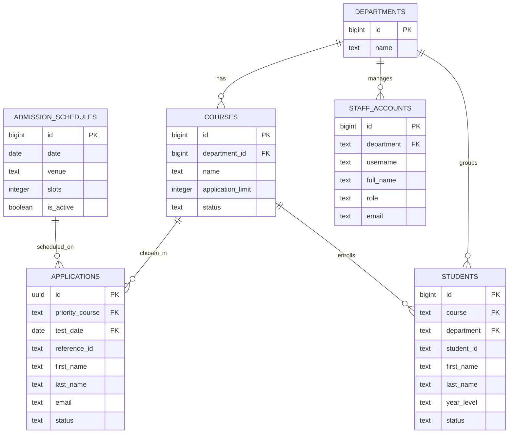
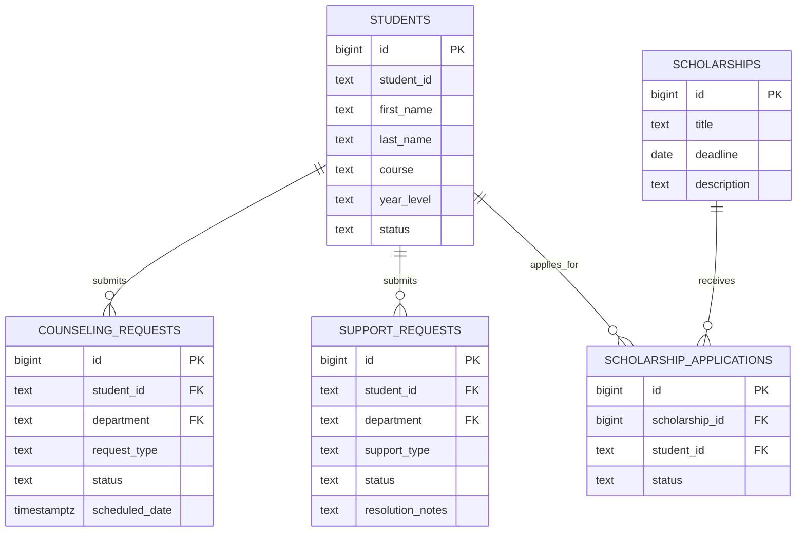
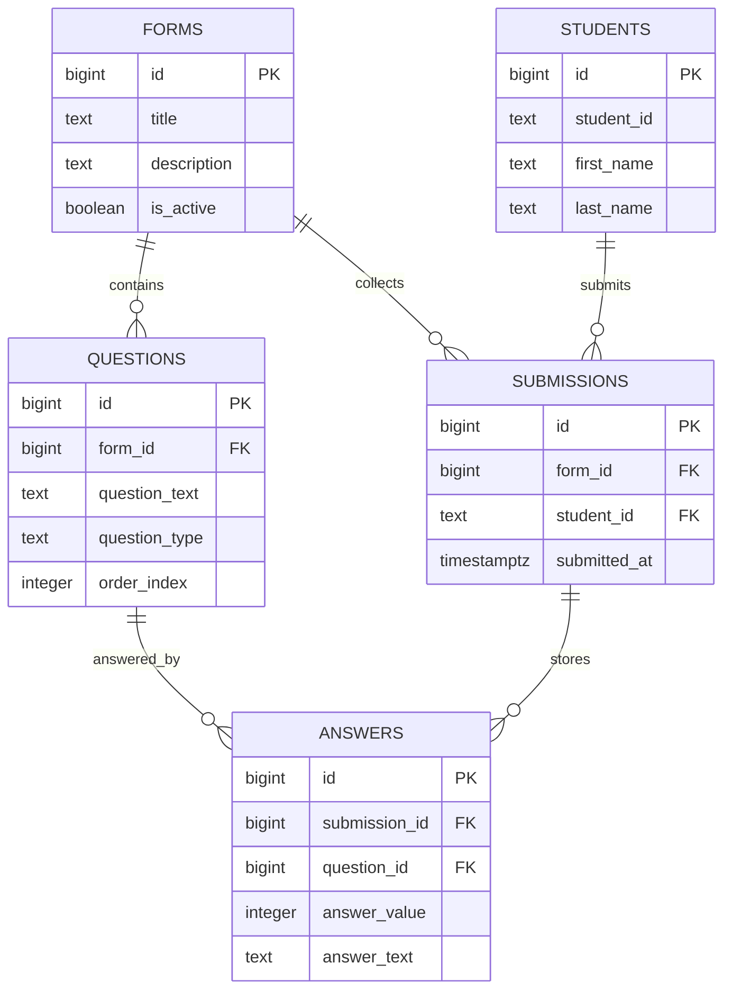
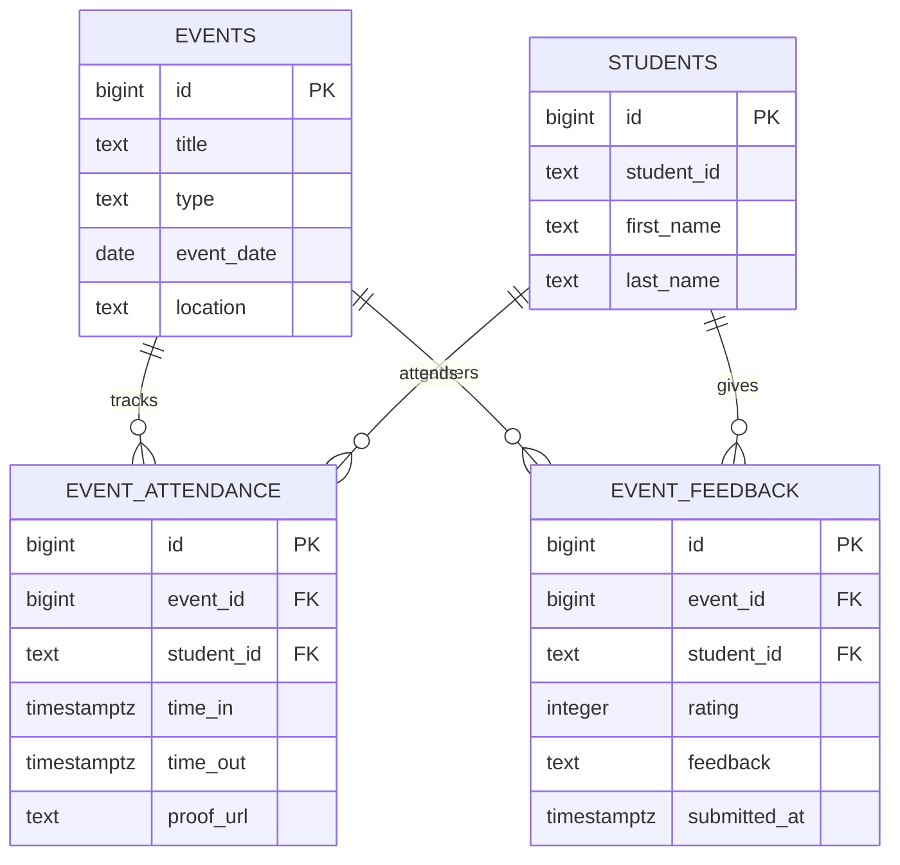

# Presentation ERD

Simplified ERD based on `supabase/schema.sql` for presentation use.
Only the major modules, tables, and key columns are included.

## Figure 1: Admissions and Academic Structure

## Figure 2: Student Services and Scholarship

## Figure 3: Needs Assessment and Forms Module

## Figure 4: Events and Participation

## Notes

- Needs assessment is represented through the `FORMS`, `QUESTIONS`, `SUBMISSIONS`, and `ANSWERS` module.
- Scholarship is included because it is an active student support feature in the current schema and codebase.
- Minor or technical tables such as `audit_logs`, `notifications`, `security_change_otps`, and `office_visit_reasons` are intentionally omitted for clarity.
