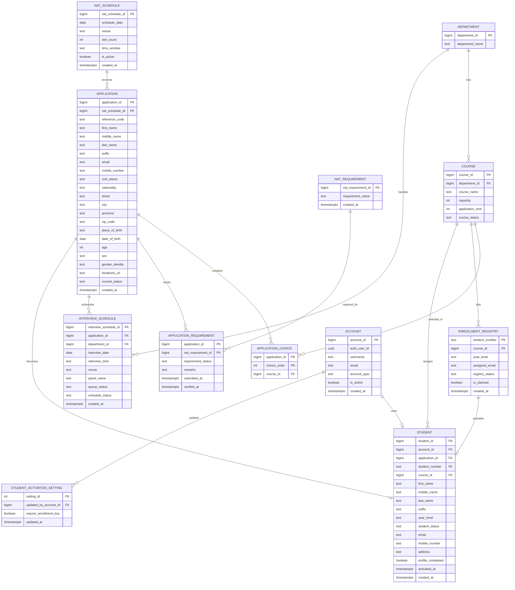

# Student Activation Whole Flow ERD

This ERD example focuses only on the **full student activation lifecycle**:

1. applicant chooses a NAT schedule
2. applicant submits an application
3. applicant selects course choices
4. staff review requirements and interview status
5. applicant is approved for enrollment
6. student number is validated against the enrollment registry
7. portal account is activated
8. final student record is created

This version is intentionally cleaner than the current live schema so the flow is easier to understand.

## 1. Main Idea of This ERD

The activation flow is not just one table.

It is a sequence of related records:

- `nat_schedules`
  - where the applicant books or belongs for NAT
- `applications`
  - the applicant's main pre-student record
- `application_choices`
  - the applicant's chosen courses
- `application_requirements`
  - whether required documents are complete
- `interview_schedules`
  - interview and admissions handling
- `enrollment_registry`
  - the official list of valid student numbers allowed to activate
- `accounts`
  - the login identity
- `students`
  - the final activated student record

The final output of the whole flow is:

- one active row in `students`

## 2. Clean Activation Flow

### Phase 1: Applicant applies

- applicant selects a NAT schedule
- applicant submits personal details
- applicant chooses first, second, and third course options

Main tables:

- `nat_schedules`
- `applications`
- `application_choices`

### Phase 2: Admissions processing

- staff track requirements
- staff schedule interviews
- applicant status changes from submitted to approved for enrollment or another result

Main tables:

- `nat_requirements`
- `application_requirements`
- `interview_schedules`
- `applications`

### Phase 3: Activation validation

- applicant receives or matches an official student number
- system checks if the student number exists in the registry
- activation settings decide whether enrollment registry checking is required

Main tables:

- `enrollment_registry`
- `student_activation_settings`

### Phase 4: Become a student

- system creates or links an account
- system creates the final student row
- registry record is marked as claimed

Main tables:

- `accounts`
- `students`
- `enrollment_registry`

## 3. Recommended ERD for This Whole Flow

## A. ENTITIES AND ATTRIBUTES

### Master Data

Department
- `department_id` (PK)
- `department_name`

Course
- `course_id` (PK)
- `department_id` (FK)
- `course_name`
- `capacity`
- `application_limit`
- `course_status`

NatSchedule
- `nat_schedule_id` (PK)
- `schedule_date`
- `venue`
- `slot_count`
- `time_window`
- `is_active`
- `created_at`

NatRequirement
- `nat_requirement_id` (PK)
- `requirement_name`
- `created_at`

### Applicant Stage

Application
- `application_id` (PK)
- `nat_schedule_id` (FK)
- `reference_code`
- `first_name`
- `middle_name`
- `last_name`
- `suffix`
- `email`
- `mobile_number`
- `civil_status`
- `nationality`
- `street`
- `city`
- `province`
- `zip_code`
- `place_of_birth`
- `date_of_birth`
- `age`
- `sex`
- `gender_identity`
- `facebook_url`
- `current_status`
- `created_at`

ApplicationChoice
- `application_id` (PK, FK)
- `choice_order` (PK)
- `course_id` (FK)

ApplicationRequirement
- `application_id` (PK, FK)
- `nat_requirement_id` (PK, FK)
- `requirement_status`
- `remarks`
- `submitted_at`
- `verified_at`

InterviewSchedule
- `interview_schedule_id` (PK)
- `application_id` (FK)
- `department_id` (FK)
- `interview_date`
- `interview_time`
- `venue`
- `panel_name`
- `queue_status`
- `schedule_status`
- `created_at`

### Activation Validation Stage

EnrollmentRegistry
- `student_number` (PK)
- `course_id` (FK)
- `year_level`
- `assigned_email`
- `registry_status`
- `is_claimed`
- `created_at`

StudentActivationSetting
- `setting_id` (PK)
- `require_enrollment_key`
- `updated_by_account_id` (FK)
- `updated_at`

### Final Student Stage

Account
- `account_id` (PK)
- `auth_user_id`
- `username`
- `email`
- `account_type`
- `is_active`
- `created_at`

Student
- `student_id` (PK)
- `account_id` (FK)
- `application_id` (FK)
- `student_number` (FK)
- `course_id` (FK)
- `first_name`
- `middle_name`
- `last_name`
- `suffix`
- `year_level`
- `student_status`
- `email`
- `mobile_number`
- `address`
- `profile_completed`
- `activated_at`
- `created_at`

## 4. Why EnrollmentRegistry Uses student_number as PK Here

This is the cleanest way to explain the activation logic.

The purpose of `enrollment_registry` is:

- to hold the official student numbers that are allowed to activate

The purpose of `students` is:

- to hold the final active student records in the portal

So the relationship is easiest to understand like this:

- `enrollment_registry.student_number`
  -> official approved number
- `students.student_number`
  -> the same approved number, now attached to an activated student record

That is why this ERD uses:

- `student_number` as the PK of `enrollment_registry`
- `student_number` as an FK in `students`

This makes the activation bridge visible in the ERD.

## 5. RELATIONSHIPS

### Master Data Relationships

- One Department can have many Courses (1:N)
- One Course can have many Applications through ApplicationChoice (1:N)
- One Course can have many EnrollmentRegistry rows (1:N)
- One Course can have many Students (1:N)

### Applicant Relationships

- One NatSchedule can have many Applications (1:N)
- One Application can have many ApplicationChoices (1:N)
- One Application can have many ApplicationRequirements (1:N)
- One NatRequirement can appear in many ApplicationRequirements (1:N)
- One Application can have many InterviewSchedules (1:N)
- One Department can handle many InterviewSchedules (1:N)

### Activation Relationships

- One EnrollmentRegistry row can produce at most one Student (1:1 logical flow)
- One Application can become one Student (1:1 logical flow)
- One Account can belong to one Student (1:1)
- One Account can update StudentActivationSetting (1:N logically, even if the table usually has one row)

## 6. SIMPLE TEXT-BASED ERD

```text
DEPARTMENT ----< COURSE

NAT_SCHEDULE ----< APPLICATION ----< APPLICATION_CHOICE >---- COURSE
APPLICATION ----< APPLICATION_REQUIREMENT >---- NAT_REQUIREMENT
APPLICATION ----< INTERVIEW_SCHEDULE >---- DEPARTMENT

COURSE ----< ENROLLMENT_REGISTRY ----o| STUDENT
APPLICATION ----o| STUDENT
ACCOUNT ----o| STUDENT
COURSE ----< STUDENT

ACCOUNT ----< STUDENT_ACTIVATION_SETTING
```

## 7. STEP-BY-STEP FLOW EXPLANATION

### Step 1: Applicant applies

The applicant is not yet a student.

The system creates:

- one row in `applications`
- one or more rows in `application_choices`

If the applicant picked:

- 1st choice = BSIT
- 2nd choice = BSED
- 3rd choice = BSBA

then:

- `applications` stores the person
- `application_choices` stores the ranked course options

### Step 2: Staff process the application

Staff review:

- missing requirements
- interview schedule
- interview result

This creates or updates:

- `application_requirements`
- `interview_schedules`
- `applications.current_status`

Example status progression:

- `submitted`
- `qualified_for_interview`
- `interview_scheduled`
- `approved_for_enrollment`

### Step 3: Enrollment registry becomes important

After approval, the student must match an official student number.

That official number lives in:

- `enrollment_registry`

This table is not the final student table.
It is the school's approved list of valid student numbers.

Example:

| student_number | course_id | year_level | is_claimed |
|---|---|---|---|
| 202600001 | BSIT | 1st Year | false |

This means:

- the number exists
- it is valid for activation
- it has not yet been claimed in the portal

### Step 4: Activation happens

When the approved applicant activates:

1. system checks `student_activation_settings`
2. system checks if `student_number` exists in `enrollment_registry`
3. system creates or links an `account`
4. system creates the final `student`
5. system marks `enrollment_registry.is_claimed = true`

### Step 5: Student is now active

The important final record is now:

- `students`

At this point:

- the application is the origin record
- the registry is the validation source
- the student is the final active portal record

## 8. WHAT TABLE IS THE FINAL TABLE?

The final table in the lifecycle is:

- `students`

Because that table represents:

- the fully activated person
- with a login/account
- with a validated student number
- with a course assignment
- ready to use the student portal

## 9. MERMAID ERD PASTE



## 10. Best Simplified Interpretation

If you want to explain this ERD in one sentence during presentation:

> The applicant starts in `applications`, is reviewed through requirements and interview records, is validated against `enrollment_registry`, then receives an `account`, and finally becomes a row in `students`.
