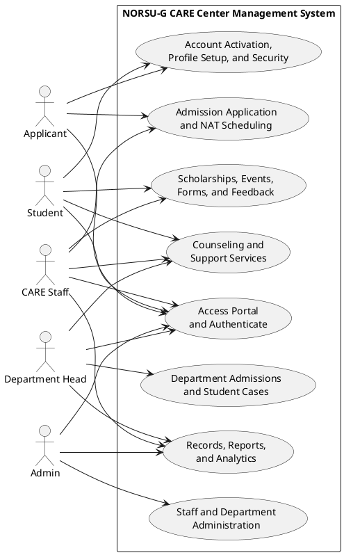

# Use Case Diagram

This version combines the five actors into a cleaner, presentation-ready diagram based on the main flows in the current codebase.

## Clean Use Case Diagram

## Straightforward Summary

- Applicant: accesses the NAT portal, applies for admission, selects a NAT schedule, and activates an account.
- Student: accesses the student portal, completes profile and security setup, requests services, and joins scholarships, events, forms, and feedback.
- Department Head: accesses the department portal, handles admissions and student cases, processes counseling and support workflows, and views records and reports.
- CARE Staff: accesses the CARE portal, manages NAT-related processes, student services, scholarships, events, forms, feedback, and analytics.
- Admin: accesses the admin portal, monitors records and reports, and manages staff accounts and departments.
