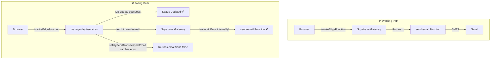

# Email Send Flow Analysis

## Root Cause: Different Invocation Patterns

The 4 working email types and the 3 non-working email types use **fundamentally different invocation paths** to reach the `send-email` edge function.

---

## ✅ Working Emails — Direct Frontend Calls

These emails are called **directly from the React frontend** → `send-email` edge function:

| Type | Called From | Method |
|------|-----------|--------|
| `NAT_SUBMISSION` | [NATPortal.tsx](file:///k:/THESIS/THESIS/norsu-system-react%20-%20Copy%20%282%29%20-%20Copy/src/pages/NATPortal.tsx) L541 | [invokeEdgeFunction('send-email', { body: {...} })](file:///k:/THESIS/THESIS/norsu-system-react%20-%20Copy%20%282%29%20-%20Copy/src/lib/invokeEdgeFunction.ts#35-85) |
| `STUDENT_ACTIVATION` | [NATPortal.tsx](file:///k:/THESIS/THESIS/norsu-system-react%20-%20Copy%20%282%29%20-%20Copy/src/pages/NATPortal.tsx) L703, [StudentLogin.tsx](file:///k:/THESIS/THESIS/norsu-system-react%20-%20Copy%20%282%29%20-%20Copy/src/pages/StudentLogin.tsx) L268 | [invokeEdgeFunction('send-email', { body: {...} })](file:///k:/THESIS/THESIS/norsu-system-react%20-%20Copy%20%282%29%20-%20Copy/src/lib/invokeEdgeFunction.ts#35-85) |
| `NAT_RESULT` | [NATManagementPage.tsx](file:///k:/THESIS/THESIS/norsu-system-react%20-%20Copy%20%282%29%20-%20Copy/src/pages/carestaff/NATManagementPage.tsx) L267 | `supabase.functions.invoke('send-email', ...)` |
| Admissions decisions | [DeptDashboard.tsx](file:///k:/THESIS/THESIS/norsu-system-react%20-%20Copy%20%282%29%20-%20Copy/src/pages/DeptDashboard.tsx) L107 | [invokeEdgeFunction('send-email', { body: {...} })](file:///k:/THESIS/THESIS/norsu-system-react%20-%20Copy%20%282%29%20-%20Copy/src/lib/invokeEdgeFunction.ts#35-85) |

**Flow:** `Browser → Supabase Gateway → send-email function → SMTP → Gmail`

The Supabase client SDK handles authentication automatically (anon key + apikey in headers). The gateway routes the request correctly.

---

## ❌ Non-Working Emails — Internal Edge-Function-to-Edge-Function Calls

These emails are called **from inside another edge function** via [safelySendTransactionalEmail()](file:///k:/THESIS/THESIS/norsu-system-react%20-%20Copy%20%282%29%20-%20Copy/supabase/functions/_shared/email.ts#69-97):

| Type | Called From Edge Function | Invocation |
|------|--------------------------|------------|
| `COUNSELING_STATUS_UPDATE` | `manage-department-services`, `manage-care-services` | [safelySendTransactionalEmail(...)](file:///k:/THESIS/THESIS/norsu-system-react%20-%20Copy%20%282%29%20-%20Copy/supabase/functions/_shared/email.ts#69-97) |
| `SUPPORT_STATUS_UPDATE` | `manage-department-services`, `manage-care-services` | [safelySendTransactionalEmail(...)](file:///k:/THESIS/THESIS/norsu-system-react%20-%20Copy%20%282%29%20-%20Copy/supabase/functions/_shared/email.ts#69-97) |
| `STAFF_ACCOUNT_CREATED` | `provision-staff-account` | [safelySendTransactionalEmail(...)](file:///k:/THESIS/THESIS/norsu-system-react%20-%20Copy%20%282%29%20-%20Copy/supabase/functions/_shared/email.ts#69-97) |

**Flow:** `Browser → Edge Function A → fetch() → Supabase Gateway → send-email function → SMTP`

The key is in [_shared/email.ts](file:///k:/THESIS/THESIS/norsu-system-react%20-%20Copy%20%282%29%20-%20Copy/supabase/functions/_shared/email.ts) lines 37–55:

```typescript
export const sendTransactionalEmail = async (payload) => {
    const supabaseUrl = Deno.env.get('SUPABASE_URL');
    const functionJwt = Deno.env.get('SUPABASE_ANON_KEY');
    const serviceRoleKey = Deno.env.get('SUPABASE_SERVICE_ROLE_KEY');
    const authKey = functionJwt || serviceRoleKey;  // ← prefers anon key

    const response = await fetch(`${supabaseUrl}/functions/v1/send-email`, {
        method: 'POST',
        headers: {
            Authorization: `Bearer ${authKey}`,
            apikey: authKey,
            'Content-Type': 'application/json'
        },
        body: JSON.stringify(payload)
    });
};
```

---

## Why the Internal Calls Fail

There are **3 likely failure points** in the edge-function-to-edge-function path:

### 1. The Local Development "Gotcha" (Docker Networking)
If you are testing this locally via `supabase start` and the Supabase CLI, the issue is almost certainly a **Docker networking problem**. 

When [safelySendTransactionalEmail](file:///k:/THESIS/THESIS/norsu-system-react%20-%20Copy%20%282%29%20-%20Copy/supabase/functions/_shared/email.ts#69-97) runs inside the `manage-department-services` Edge Function (which executes inside an isolated Docker container), it attempts to call:
`fetch('http://127.0.0.1:54321/functions/v1/send-email')`

However, **inside that container, `127.0.0.1` points to the container itself**, NOT your host machine's Supabase API gateway. The container cannot find an API running on its own local port 54321, resulting in a silent `ECONNREFUSED` exception that gets swallowed by the `try/catch` block inside [safelySendTransactionalEmail](file:///k:/THESIS/THESIS/norsu-system-react%20-%20Copy%20%282%29%20-%20Copy/supabase/functions/_shared/email.ts#69-97).

When the frontend (React) makes the exact same call via [invokeEdgeFunction](file:///k:/THESIS/THESIS/norsu-system-react%20-%20Copy%20%282%29%20-%20Copy/src/lib/invokeEdgeFunction.ts#35-85), it succeeds because the browser evaluates `http://127.0.0.1:54321` as your host machine's port.

### 2. `SUPABASE_ANON_KEY` is not available inside edge functions
> [!CAUTION]
> `SUPABASE_ANON_KEY` is **not** a default Supabase-injected secret for edge functions. Only `SUPABASE_URL` and `SUPABASE_SERVICE_ROLE_KEY` are auto-injected. If `SUPABASE_ANON_KEY` was not manually set as a secret, `functionJwt` will be `undefined`, and it falls back to `serviceRoleKey`.

### 3. Edge function self-invocation via the public gateway 
Edge functions calling other edge functions through the **public API Gateway** face issues:
- The gateway applies its own auth validation — the `Authorization: Bearer <service_role_key>` may not pass the gateway's JWT verification correctly (service role keys are meant for admin SDK usage, not for the function invocation REST endpoint)
- Some Supabase plans have internal looping or invocation limits that compound when chaining


---

## Evidence Summary



---

## Recommended Solutions

Here are the 3 best ways to fix this, ranked from best architectural design to quickest fix.

### 🥇 Solution 1: Refactor to a Shared Mailer (Best Practice)
Instead of forcing your Edge Functions to make expensive network HTTP calls to *other* Edge Functions, you should extract the raw email sending logic (the SMTP client and templates) into `supabase/functions/_shared/mailer.ts` or [email.ts](file:///k:/THESIS/THESIS/norsu-system-react%20-%20Copy%20%282%29%20-%20Copy/supabase/functions/_shared/email.ts).

Both `send-email` and `manage-department-services` can then simply import that function and execute it directly within the same runtime environment.

**Pros:**
* Zero network latency (no HTTP gateway hit)
* Zero authentication issues (it's just a local file import)
* Works perfectly in local dev and production

**How to implement:**
1. Move [buildEmailTemplate](file:///k:/THESIS/THESIS/norsu-system-react%20-%20Copy%20%282%29%20-%20Copy/supabase/functions/send-email/source/index.ts#66-217) and the `denomailer` logic from [send-email/source/index.ts](file:///k:/THESIS/THESIS/norsu-system-react%20-%20Copy%20%282%29%20-%20Copy/supabase/functions/send-email/source/index.ts) to [_shared/email.ts](file:///k:/THESIS/THESIS/norsu-system-react%20-%20Copy%20%282%29%20-%20Copy/supabase/functions/_shared/email.ts).
2. Update [safelySendTransactionalEmail](file:///k:/THESIS/THESIS/norsu-system-react%20-%20Copy%20%282%29%20-%20Copy/supabase/functions/_shared/email.ts#69-97) to invoke this shared SMTP logic directly instead of using [fetch()](file:///k:/THESIS/THESIS/norsu-system-react%20-%20Copy%20%282%29%20-%20Copy/src/pages/NATPortal.tsx#236-296).

### 🥈 Solution 2: Send from the Frontend (Like NAT Does)
You can modify the non-working functions (`manage-department-services`, `manage-care-services`, and `provision-staff-account`) to return the email payload back to the React frontend. Then, the frontend explicitly calls `send-email` using [invokeEdgeFunction](file:///k:/THESIS/THESIS/norsu-system-react%20-%20Copy%20%282%29%20-%20Copy/src/lib/invokeEdgeFunction.ts#35-85).

This is exactly how `NAT_SUBMISSION`, `NAT_RESULT`, and `STUDENT_ACTIVATION` work today.

**Pros:**
* Consistent with the rest of your working codebase
* Offloads the wait time to the client rather than blocking the Edge Function execution time

**How to implement:**
1. In [DeptDashboard.tsx](file:///k:/THESIS/THESIS/norsu-system-react%20-%20Copy%20%282%29%20-%20Copy/src/pages/DeptDashboard.tsx) and `DeptModals.tsx`, capture the result of the `invokeManagedDepartmentServicesFunction` call.
2. If successful, fire a second immediate call to [invokeEdgeFunction('send-email', { ... })](file:///k:/THESIS/THESIS/norsu-system-react%20-%20Copy%20%282%29%20-%20Copy/src/lib/invokeEdgeFunction.ts#35-85) using the data returned from the first call.

### 🥉 Solution 3: The Quick Networking Fix (Environment Variables)
If you want to keep the Edge-Function-to-Edge-Function HTTP call via [fetch](file:///k:/THESIS/THESIS/norsu-system-react%20-%20Copy%20%282%29%20-%20Copy/src/pages/NATPortal.tsx#236-296) but just make it work locally, you need to point the Edge Function to the correct Docker host IP.

**How to implement:**
1. In your local `.env.local` or environment file for the edge functions, change `SUPABASE_URL` from `http://127.0.0.1:54321` to your machine's actual local IP address (e.g., `http://192.168.1.5:54321`) or `http://host.docker.internal:54321` (if on Docker Desktop for Mac/Windows).
2. Ensure `SUPABASE_ANON_KEY` is properly injected.
