# NORSU System — Entity Relationship Diagram & Schema Analysis

## ERD Diagram

---

## System Overview

The NORSU system is a **university student services management platform** built with React + Supabase. It has **4 main portals**: Admin, CARE Staff, Department, and Student, and covers admissions, counseling, support requests, events, scholarships, surveys, and office visits.

---

## Important Tables & Key Columns

### Core Identity Tables

| Table | Key Columns | Purpose |
|-------|-------------|---------|
| **students** | `student_id` (PK-unique), `first_name`, `last_name`, `course`, `year_level`, `department`, `email`, `auth_user_id` | Central student record — all services FK here |
| **staff_accounts** | `id` (PK), `username`, `role`, `department`, `email`, `auth_user_id` | Admin / CARE Staff / Dept Head accounts |
| **departments** | `id` (PK), `name` (unique) | Academic departments lookup |
| **courses** | `id` (PK), `name` (unique), `department_id` → departments | Programs offered per department |

### Admissions Module

| Table | Key Columns | Purpose |
|-------|-------------|---------|
| **applications** | `id` (PK), `reference_id`, `student_id` → students, `priority_course` → courses, `test_date` → admission_schedules, `status` | NAT applicant records |
| **admission_schedules** | `id` (PK), `date` (unique), `venue`, `slots`, `time_windows` | Exam/interview schedule slots |
| **enrolled_students** | `student_id` (PK), `course` → courses, `status`, `year_level` | Pre-registered student IDs for account activation |

### Student Services Module

| Table | Key Columns | Purpose |
|-------|-------------|---------|
| **counseling_requests** | `id` (PK), `student_id` → students, `department` → departments, `request_type`, `status`, `scheduled_date` | Counseling & referral requests |
| **support_requests** | `id` (PK), `student_id` → students, `department` → departments, `support_type`, `status`, `care_notes`, `dept_notes` | Dean-endorsed support tickets |
| **office_visits** | `id` (PK), `student_id` → students, `reason` → office_visit_reasons, `time_in`, `time_out`, `status` | Walk-in office visit logs |
| **office_visit_reasons** | `id` (PK), `reason` (unique) | Configurable visit reason lookup |
| **notifications** | `id` (PK), `student_id` → students, `message`, `is_read` | Student notification inbox |

### Events & Attendance Module

| Table | Key Columns | Purpose |
|-------|-------------|---------|
| **events** | `id` (PK), `title`, `type`, `event_date`, `location`, `latitude`, `longitude` | University events |
| **event_attendance** | `id` (PK), `event_id` → events, `student_id` → students, `time_in`, `time_out`, `proof_url`, `department` → departments | Geo-tagged attendance records |
| **event_feedback** | `id` (PK), `event_id` → events, `student_id` → students, `rating`, `q1_score`–`q7_score` | Post-event satisfaction surveys |

### Scholarships Module

| Table | Key Columns | Purpose |
|-------|-------------|---------|
| **scholarships** | `id` (PK), `title`, `deadline`, `requirements` | Available scholarship listings |
| **scholarship_applications** | `id` (PK), `scholarship_id` → scholarships, `student_id` → students, `status` | Student scholarship applications |

### Surveys / Forms Module

| Table | Key Columns | Purpose |
|-------|-------------|---------|
| **forms** | `id` (PK), `title`, `is_active` | Configurable survey forms |
| **questions** | `id` (PK), `form_id` → forms, `question_text`, `question_type`, `order_index` | Survey questions |
| **submissions** | `id` (PK), `form_id` → forms, `student_id` → students | Survey submission header |
| **answers** | `id` (PK), `submission_id` → submissions, `question_id` → questions, `answer_value`, `answer_text` | Individual question answers |
| **general_feedback** | `id` (PK), `student_id`, `cc1`–`cc3`, `sqd0`–`sqd8` | Citizen's Charter feedback form |

### System Tables

| Table | Key Columns | Purpose |
|-------|-------------|---------|
| **audit_logs** | `id` (PK), `user_name`, `action`, `details` | Activity audit trail |
| **security_change_otps** | `id` (PK), `auth_user_id`, `purpose`, `otp_hash`, `expires_at` | OTP for password/email changes |
| **nat_requirements** | `id` (PK), `name` | NAT exam requirement checklist items |

---

## Simplified ERD (Mermaid)

This diagram focuses on the **core entities and their relationships**, similar in style to the reference ERD you showed. Only the most important columns (PK, FK, key descriptors) are included.

```mermaid
erDiagram

    departments {
        bigint id PK
        text name UK
    }

    courses {
        bigint id PK
        text name UK
        bigint department_id FK
    }

    students {
        bigint id PK
        text student_id UK
        text first_name
        text last_name
        text email
        text course FK
        text department FK
    }

    staff_accounts {
        bigint id PK
        text username UK
        text role
        text department FK
    }

    applications {
        uuid id PK
        text reference_id UK
        text student_id FK
        text priority_course FK
        date test_date FK
        text status
    }

    admission_schedules {
        bigint id PK
        date date UK
        text venue
        integer slots
    }

    enrolled_students {
        text student_id PK
        text course FK
        text status
    }

    counseling_requests {
        bigint id PK
        text student_id FK
        text department FK
        text request_type
        text status
    }

    support_requests {
        bigint id PK
        text student_id FK
        text department FK
        text support_type
        text status
    }

    events {
        bigint id PK
        text title
        text type
        date event_date
    }

    event_attendance {
        bigint id PK
        bigint event_id FK
        text student_id FK
        text department FK
    }

    event_feedback {
        bigint id PK
        bigint event_id FK
        text student_id FK
        integer rating
    }

    scholarships {
        bigint id PK
        text title
        date deadline
    }

    scholarship_applications {
        bigint id PK
        bigint scholarship_id FK
        text student_id FK
        text status
    }

    office_visits {
        bigint id PK
        text student_id FK
        text reason FK
    }

    office_visit_reasons {
        bigint id PK
        text reason UK
    }

    forms {
        bigint id PK
        text title
    }

    questions {
        bigint id PK
        bigint form_id FK
        text question_text
    }

    submissions {
        bigint id PK
        bigint form_id FK
        text student_id FK
    }

    answers {
        bigint id PK
        bigint submission_id FK
        bigint question_id FK
    }

    notifications {
        bigint id PK
        text student_id FK
        text message
    }

    departments ||--o{ courses : "has"
    departments ||--o{ students : "belongs to"
    departments ||--o{ staff_accounts : "assigned to"
    departments ||--o{ counseling_requests : "routed to"
    departments ||--o{ support_requests : "endorsed to"
    departments ||--o{ event_attendance : "tagged"

    courses ||--o{ applications : "applied for"
    courses ||--o{ enrolled_students : "enrolled in"

    students ||--o{ applications : "submits"
    students ||--o{ counseling_requests : "files"
    students ||--o{ support_requests : "files"
    students ||--o{ office_visits : "logs"
    students ||--o{ event_attendance : "attends"
    students ||--o{ event_feedback : "rates"
    students ||--o{ scholarship_applications : "applies"
    students ||--o{ submissions : "submits"
    students ||--o{ notifications : "receives"

    admission_schedules ||--o{ applications : "scheduled on"

    events ||--o{ event_attendance : "has"
    events ||--o{ event_feedback : "has"

    scholarships ||--o{ scholarship_applications : "has"

    office_visit_reasons ||--o{ office_visits : "categorized by"

    forms ||--o{ questions : "contains"
    forms ||--o{ submissions : "collects"
    submissions ||--o{ answers : "contains"
    questions ||--o{ answers : "answered in"
```

---

## Relationship Summary

The **`students`** table is the central hub — almost every service table has a foreign key pointing to `students.student_id`. The **`departments`** table acts as a shared lookup for courses, staff, students, counseling, support, and attendance. Here's the count of direct FK relationships per table:

| Entity | Incoming FKs (referenced by) | Outgoing FKs (references) |
|--------|------------------------------|---------------------------|
| **students** | 9 tables | 2 (departments, courses) |
| **departments** | 6 tables | — |
| **courses** | 3 tables | 1 (departments) |
| **events** | 2 tables | — |
| **forms** | 2 tables | — |
| **scholarships** | 1 table | — |
| **office_visit_reasons** | 1 table | — |
| **admission_schedules** | 1 table | — |
| **submissions** | 1 table | 2 (forms, students) |
| **questions** | 1 table | 1 (forms) |
